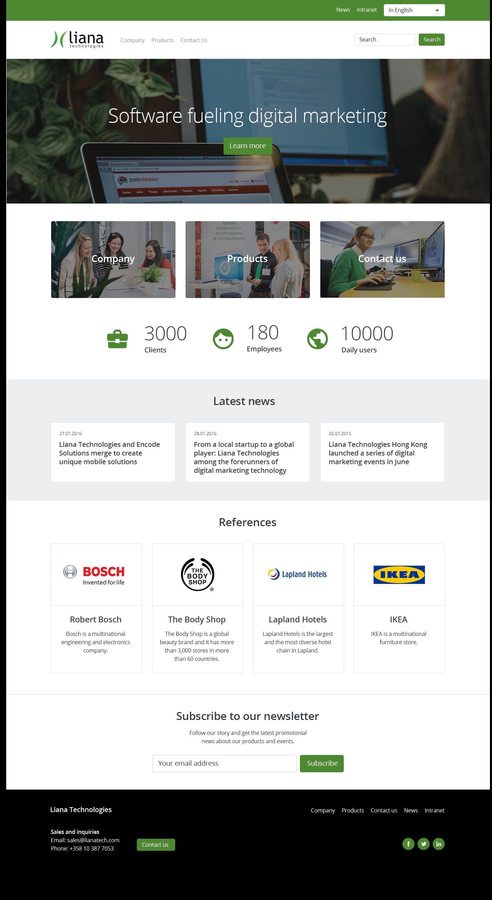

## Task overview

The project took about couple hours to create the essential features.
Tools used :
* React
* Bootsrap
* Fontawesome.com
* React social icons (npm package)

## Problems i faced

There were a couple of issues with the css, with more time i would have been able to fix them

## What i learned
When i first started building the project i thought that there wouldn't be much css used, therefore i simply added css by injecting it on to the react components directly. I should have created seperate css files from the beginning.

## Other stuff

There are couple of css issues which i might still fix and the project file management could use some work.
other than that i think i did a pretty good job!

## Reference image

